# os1 — a RISC-V thread kernel

A small supervisor-mode kernel for RISC-V (RV64IMA), written in C++11 and freestanding: no libc, no
paging, no filesystem, no processes. It implements four things — a memory allocator, threads with
preemptive scheduling, counting semaphores, and an interrupt-driven console — and exposes each of
them through three stacked interfaces: a raw `ecall` ABI, a C API, and a C++ API.

This is the *Operativni sistemi 1* (2025/26) course project at the University of Belgrade. The
assignment is in [`docs/md/OS1-Projektni-zadatak-2026-v1.0.md`](docs/md/OS1-Projektni-zadatak-2026-v1.0.md);
`lib/hw.lib` is the course-supplied hardware-access layer and is the only thing here that is not
this project's own code.

**It is not xv6.** `lib/hw.lib` *is* xv6-derived — it supplies the machine-mode boot, the PLIC
helpers and the initial UART bring-up — but the kernel above it shares no source with xv6 and is
built on quite different foundations:

| | this kernel |
|---|---|
| Address space | one, flat, physical. `satp = 0`, paging never enabled |
| Isolation | the privilege bit only. "User mode" means `sstatus.SPP = 0` in the same address space |
| Unit of execution | threads. No PID, no process table, no `fork`/`exec`/`wait`, no ELF loader |
| Saved context | **two registers** (`ra`, `sp`) — not xv6's fourteen |
| Kernel stack | none separate; a trap pushes its frame onto the interrupted thread's own stack |
| Storage | none. No block device, no filesystem, no `mkfs` |
| Locking | none. Uniprocessor by construction, and the kernel never preempts itself |

**Status.** All four parts are implemented across all three interface layers, and all seven public
tests behave — 1 through 6 run to completion and print their closing line, 7 traps from user mode
exactly as it is designed to. Read [Known gaps and risks](#20-known-gaps-and-risks) before trusting
that summary further than it goes.

---

## Contents

1. [Quick start](#1-quick-start)
2. [Repository layout](#2-repository-layout)
3. [Architecture: three interfaces over one kernel](#3-architecture-three-interfaces-over-one-kernel)
4. [Boot: from `0x80000000` to `userMain()`](#4-boot-from-0x80000000-to-usermain)
5. [Memory map](#5-memory-map)
6. [The ABI](#6-the-abi)
7. [Trap entry and the frame](#7-trap-entry-and-the-frame)
8. [Threads](#8-threads)
9. [The scheduler](#9-the-scheduler)
10. [Preemption, the timer, and `time_sleep`](#10-preemption-the-timer-and-time_sleep)
11. [Semaphores](#11-semaphores)
12. [The memory allocator](#12-the-memory-allocator)
13. [The console](#13-the-console)
14. [The C++ API layer](#14-the-c-api-layer)
15. [Class overview](#15-class-overview)
16. [Build system](#16-build-system)
17. [Running the tests](#17-running-the-tests)
18. [Debugging](#18-debugging)
19. [Design decisions](#19-design-decisions)
20. [Known gaps and risks](#20-known-gaps-and-risks)
21. [Practice-modification branches](#21-practice-modification-branches)
22. [Spec, grading, licence](#22-spec-grading-licence)

---

## 1. Quick start

The build needs a RISC-V cross toolchain and GNU make. The `Dockerfile` provides both.

```bash
docker build -t riscv-kernel .
```

On **macOS**, copy the tree into the container rather than bind-mounting onto `/kernel` — the
Makefile has no `%.S` rule and a case-insensitive filesystem will let make destroy the assembly
sources. The reason is spelled out in [§16](#16-build-system); the safe form is:

```bash
docker run --rm -it -v "$(pwd)":/src riscv-kernel bash -c 'cp -a /src/. /kernel/ && make qemu'
```

On **Linux** the plain bind-mount is fine, and gives you a shell you can iterate in:

```bash
docker run -it --rm --name os1 -v "$(pwd)":/kernel riscv-kernel bash
make          # build:        ./kernel + ./kernel.asm
make qemu     # build + run
make clean
```

Quit QEMU with **Ctrl-A** then **X**. On boot the kernel prints `Unesite broj testa? [1-7]` —
type a digit and Enter. See [§17](#17-running-the-tests) for what each test does and how to drive
them non-interactively.

---

## 2. Repository layout

| Path | What it is |
|---|---|
| `src/` | The kernel. 11 C++ files and 2 assembly files, ~1,300 lines total |
| `h/` | Kernel headers. Renamed to `inc/` at submission — the spec wants a zip of exactly `src/` + `inc/` |
| `lib/` | Course-supplied prebuilt binaries. `hw.lib` + `hw.h` are used; `mem.lib` and `console.lib` are **not linked** any more |
| `test/` | The seven public tests, verbatim as supplied. Only `userMain.cpp` may be edited |
| `docs/md/`, `docs/pdf/` | The assignment, and a Docker cheatsheet |
| `Makefile` | The real build. GNU make only |
| `kernel.ld` | Linker script — `ENTRY(_entry)`, load at `0x80000000` |
| `Dockerfile` | `ubuntu:20.04` + `gcc-riscv64-unknown-elf`, `qemu-system-misc`, `gdb-multiarch` |
| `CMakeLists.txt` | **Indexing only** for CLion/clangd. Its executable target will not link on a host toolchain |
| `build/` | Object tree, dependency files, and per-file assembler listings. Ignored by git |

Two generated artefacts sit at the root after a build and are ignored: `kernel` (the ELF QEMU
boots) and `kernel.asm` (an `objdump --source` listing of it — the first thing to open when a trap
reports an address you do not recognise).

---

## 3. Architecture: three interfaces over one kernel

Everything — tests, the three interface layers, the kernel, and `hw.lib` — is statically linked
into a single ELF and lives in one address space. The only boundary is the privilege bit.

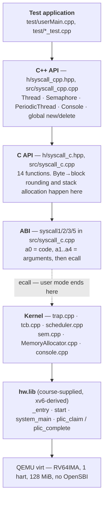

Everything from the C++ API down to the kernel is this project's work. The layering is strict: each
layer may only use the one directly beneath it, which is why `Thread::sleep` calls `time_sleep`
calls `ecall 0x31` rather than reaching into `_thread::sleep` directly.

`LIBS` in the Makefile is down to `hw.lib` alone. The course also ships `mem.lib` (a scaffold
allocator) and `console.lib` (a scaffold console); both were dropped from the link once the real
implementations landed. The link itself is the proof that nothing leans on them — no unresolved
`__mem_alloc`, `__putc`, or `console_handler`.

---

## 4. Boot: from `0x80000000` to `userMain()`

QEMU is launched with `-bios none`, so there is no OpenSBI: the machine begins executing at
`0x80000000` in **machine mode**. Everything up to `main()` lives inside `hw.lib`.

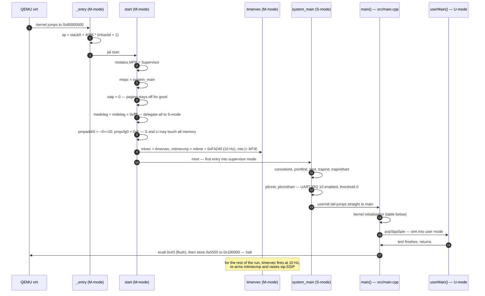

At `main()`'s first instruction the machine is in supervisor mode, paging is off, interrupts are
delegated to S-mode but **globally masked** (`sstatus.SIE = 0`), `stvec` still points at `hw.lib`'s
own `kernelvec`, and the stack is `hw.lib`'s `stack0`.

`main()` — [`src/main.cpp:22`](src/main.cpp) — then does nine things, in an order where most of the
steps depend on the ones before them:

| # | Step | Why it is where it is |
|---|---|---|
| 1 | `w_stvec(&trapVector \| DIRECT)` | Replaces `hw.lib`'s handler with ours. Must happen **before** anything is unmasked, and before the first `ecall` in step 3 |
| 2 | `running = createThread(nullptr, …, userMode=true)` | A **bodiless** TCB that adopts the currently-executing flow. `body == nullptr` gives `Context{ra = 0, sp = 0}` — nothing is ever loaded from it, only saved into it. `stackBase == nullptr` so the reaper never tries to free `stack0` |
| 3 | `mem_alloc(DEFAULT_STACK_SIZE)` | 4 KiB for the idle thread. This is the **C API** `mem_alloc`, i.e. the first `ecall` the new `trapVector` ever handles. Step 2 already triggered lazy allocator init via the first `getInstance()` — there is no explicit allocator-init call anywhere |
| 4 | `createThread(idleBody, …, userMode=false)` | `idleBody` is `for(;;) thread_dispatch();`. Kernel mode, so it never leaves supervisor |
| 5 | `Scheduler::setIdle(idle)` | Idle is held aside, not queued — see [§9](#9-the-scheduler) |
| 6 | `_console::init()` | Opens the three console semaphores, starts the drainer thread, enables the UART receive interrupt. Needs the allocator (2) and the scheduler (5) to already work |
| 7 | `ms_sie(SI_SSI \| SI_SEI)` | Enables the software interrupt (the forwarded timer) and the external interrupt (UART via PLIC). `SI_STI` is deliberately **not** set — the timer never arrives that way here |
| 8 | `mc_sstatus(SPP)`, `ms_sstatus(SPIE)` | Arms the next `sret`: land in user mode, with interrupts on. Mode bits are always set explicitly, never inherited |
| 9 | `popSppSpie()` | `csrw sepc, ra; sret` — a hand-rolled return-to-user that needs no trap frame. From here `main` itself is user code |

After `userMain()` returns, `main` issues `ecall 0x43` to drain the console and then halts the
machine by storing the 32-bit value `0x5555` to `0x100000`.

---

## 5. Memory map

```
0x00100000   SiFive test finisher — store u32 0x5555 here to shut QEMU down
0x02000000   CLINT — mtime / mtimecmp, owned by machine mode
0x0C000000   PLIC — priority, enable, threshold, claim/complete
0x10000000   UART0, a 16550
             +0  CONSOLE_TX_DATA / CONSOLE_RX_DATA
             +1  IER   (hw.h does not name it; console.cpp derives it as TX_DATA + 1)
             +5  CONSOLE_STATUS (the line status register)
-------------------------------------------------------------- kernel image
0x80000000   .text      — *(.entry_os) first, so _entry lands exactly here
             .rodata
             .data
             .bss
             end        — provided by kernel.ld
-------------------------------------------------------------- heap
HEAP_START_ADDR .. HEAP_END_ADDR-1
             HEAP_START_ADDR == end, so it moves whenever the image changes size
             (0x8000ce60 in the current build)
0x88000000   HEAP_END_ADDR — 128 MiB, matching QEMU's -m 128M
```

`HEAP_START_ADDR`, `HEAP_END_ADDR` and the three `CONSOLE_*` addresses are **data inside `hw.lib`**,
declared `extern const` in [`lib/hw.h`](lib/hw.h) — not compile-time constants. The allocator reads
them at first use and rounds the bounds inward to a whole number of blocks.

The remaining constants in `lib/hw.h` are compile-time:

```c
static const size_t DEFAULT_STACK_SIZE  = 4096;
static const size_t DEFAULT_TIME_SLICE  = 2;      // timer periods, so 200 ms at 10 Hz
static const size_t MEM_BLOCK_SIZE      = 64;
static const uint64 CONSOLE_IRQ         = 10;
static const uint64 CONSOLE_TX_STATUS_BIT = 1 << 5;
static const uint64 CONSOLE_RX_STATUS_BIT = 1;
```

---

## 6. The ABI

A system call is an `ecall`. The register convention is the whole of the binary interface:

- **`a0`** — the call code, going in; the return value, coming out.
- **`a1`, `a2`, `a3`, `a4`** — arguments, left to right as they appear in the C signature.

[`src/syscall_c.cpp`](src/syscall_c.cpp) has four helpers for this (`syscall1`, `syscall2`,
`syscall3`, `syscall5`, named for total register count), each pinning its operands to physical
registers with `register uint64 a0 __asm__("a0")` and clobbering `"memory"` so the compiler cannot
move loads and stores across the trap.

| Code | C API | Kernel entry point |
|:---:|---|---|
| `0x01` | `void* mem_alloc(size_t)` | `MemoryAllocator::mem_alloc` |
| `0x02` | `int mem_free(void*)` | `MemoryAllocator::mem_free` |
| `0x11` | `int thread_create(thread_t*, void(*)(void*), void*)` | `_thread::createThread` + `Scheduler::put` |
| `0x12` | `int thread_exit()` | `_thread::exit` |
| `0x13` | `void thread_dispatch()` | `_thread::dispatch` |
| `0x21` | `int sem_open(sem_t*, unsigned)` | `_sem::open` |
| `0x22` | `int sem_close(sem_t)` | `_sem::close` |
| `0x23` | `int sem_wait(sem_t)` | `_sem::wait(h, 1)` |
| `0x24` | `int sem_signal(sem_t)` | `_sem::signal(h, 1)` |
| `0x25` | `int sem_wait_n(sem_t, unsigned n)` | `_sem::wait(h, n)` |
| `0x26` | `int sem_signal_n(sem_t, unsigned n)` | `_sem::signal(h, n)` |
| `0x31` | `int time_sleep(time_t)` | `_thread::sleep` |
| `0x41` | `char getc()` | `_console::getc` |
| `0x42` | `void putc(char)` | `_console::putc` |
| `0x43` | *(none — kernel-internal)* | `_console::flush` |
| — | anything else | returns `-1` |

`0x43` is **not part of the course ABI**. It exists because `main` has permanently dropped to user
mode by the time `userMain()` returns, and the store that halts the machine takes effect
immediately — without a flush, the closing line of every test would die unsent in the output ring.
It is issued by a hand-written `ecall` in `src/main.cpp` rather than through the C API, precisely so
it does not look like part of the public interface.

### Where the ABI and the C API deliberately disagree

Two calls are not a straight pass-through, and the spec requires both divergences:

- **`0x01` counts blocks, the C API counts bytes.** `mem_alloc(size)` rounds `size` up to whole
  `MEM_BLOCK_SIZE` (64-byte) blocks before the `ecall`, and rejects a size so large that the
  rounding itself would wrap.
- **`0x11` takes a stack, the C API allocates one.** The ABI signature is effectively
  `thread_create(handle, start_routine, arg, stack_space)`, where `stack_space` points at the
  **end** of an already-reserved region. The C API allocates `DEFAULT_STACK_SIZE` first, passes
  `base + DEFAULT_STACK_SIZE`, and frees the stack again if the call fails. The kernel re-derives
  `stackBase` by subtracting `DEFAULT_STACK_SIZE`.

### One call, end to end

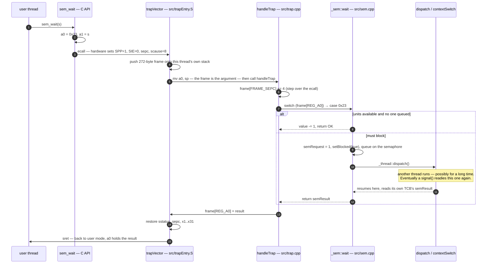

Every other call is this same loop with a different case label. That is the whole system.

---

## 7. Trap entry and the frame

`stvec` is written once, in **direct** mode: one entry point, and `handleTrap` demultiplexes on
`scause`. [`src/trapEntry.S`](src/trapEntry.S) is the entire entry path — 38 lines.

It pushes a 34-slot, 272-byte frame **onto the interrupted thread's own stack**. There is no stack
switch, no `sscratch` dance, and no trampoline page, because there is nothing to switch to and no
address space to change.

```
sp on entry ──▶ ┌─────────────────────────────┐ slot  0   (x0 — space reserved, never written)
                │  x1  ra                     │ slot  1   REG_RA
                │  x2  sp  (value before the  │ slot  2   REG_SP
                │          272-byte push)     │
                │  x3 … x9                    │ slots 3–9
                │  x10 a0  ← call code / ret  │ slot 10   REG_A0
                │  x11 a1  ← argument 1       │ slot 11   REG_A1
                │  x12 a2  ← argument 2       │ slot 12   REG_A2
                │  x13 a3  ← argument 3       │ slot 13   REG_A3
                │  x14 a4  ← argument 4       │ slot 14   REG_A4
                │  x15 … x31                  │ slots 15–31
                │  sepc                       │ slot 32   FRAME_SEPC
                │  sstatus                    │ slot 33   FRAME_SSTATUS
                └─────────────────────────────┘ 34 × 8 = 272 bytes
```

`mv a0, sp` then makes the frame itself the argument to `handleTrap`, which is why the handler
reads arguments as `frame[REG_A1]` and returns a value by writing `frame[REG_A0]`. For an `ecall`
it first does `frame[FRAME_SEPC] += 4`, because `sepc` points *at* the `ecall` instruction and
returning to it unchanged would re-execute the call forever.

Two consequences of putting the frame on the thread's own stack are worth stating plainly, because
the rest of the kernel is built on them:

- **`sepc` and `sstatus` need no special handling across a context switch.** They live in the
  frame, the frame lives on the stack, and the stack belongs to the thread. A `dispatch()` in the
  middle of a trap needs zero CSR bookkeeping — each thread restores its own copy on the way out.
- **The saved `Context` can be two registers**, because everything else is already on that stack.

### `scause` demultiplexing

| `scause` | Meaning | Handler |
|---|---|---|
| `0x08` | `ecall` from user mode | syscall switch |
| `0x09` | `ecall` from supervisor mode | same switch — kernel threads use it too |
| `(1<<63) \| 1` | supervisor **software** interrupt — this is the timer | `mc_sip(SI_SSI)` then `_thread::tick()` |
| `(1<<63) \| 9` | supervisor **external** interrupt — the UART, via the PLIC | `_console::handleIrq()` |
| anything else | a fault | print `scause` and `sepc`, then halt the machine |

The timer arriving as a *software* interrupt is not a mistake. `hw.lib` keeps `mtimecmp` in machine
mode; its `timervec` re-arms the comparator and then raises `sip.SSIP` to hand the event down to
supervisor mode. The kernel therefore acknowledges the timer with `csrc sip, 2` and never sees
`scause` code 5. `Riscv::INT_TIMER` is declared in `h/riscv.hpp` but no path reaches it.

Clearing `sip.SSIP` must happen **before** `tick()`, not after: `SSIP` is a level bit, and `tick()`
may well not return to this thread for a long time.

The fault path writes the UART directly through `_console::putcSync`, bypassing the buffered
console — the console may be exactly what has died. It then halts through the same
`0x5555 → 0x100000` store used for a normal shutdown, which is what lets [test 7](#17-running-the-tests)
terminate the emulator instead of wedging it.

---

## 8. Threads

The TCB is a class called `_thread`, and `thread_t` is a `_thread*` — so a handle needs no cast, no
lookup table, and no validation pass. [`h/tcb.hpp`](h/tcb.hpp):

| Field | Purpose |
|---|---|
| `Context context` | `{ra, sp}` — the entire saved machine state. See below |
| `Body body`, `void* arg` | What to run. `body == nullptr` marks a TCB that adopted an already-running flow |
| `void* stackBase` | Exactly what `mem_alloc` returned, so the reaper can hand back the same pointer. `nullptr` for bodiless threads |
| `bool userMode` | `false` leaves `SPP` alone, keeping the thread in supervisor mode |
| `bool finished` | Set by `exit()`; stops `dispatch()` re-queueing the thread |
| `bool blocked` | The general "not runnable" flag — used by both semaphores and the sleep list |
| `unsigned semRequest` | How many units this thread is waiting for |
| `int semResult` | How its wait ended: `0`, or a `_sem::Error` |
| `uint64 timeSlice` | Quantum remaining, in timer periods |
| `uint64 sleepTime` | Gap to the previous node in the sleep list |
| `_thread* next` | Intrusive link, shared by the ready queue, every semaphore queue, and the sleep list |

The whole object is 80 bytes, so a TCB costs three 64-byte blocks: one allocator header plus two of
payload.

### Life cycle

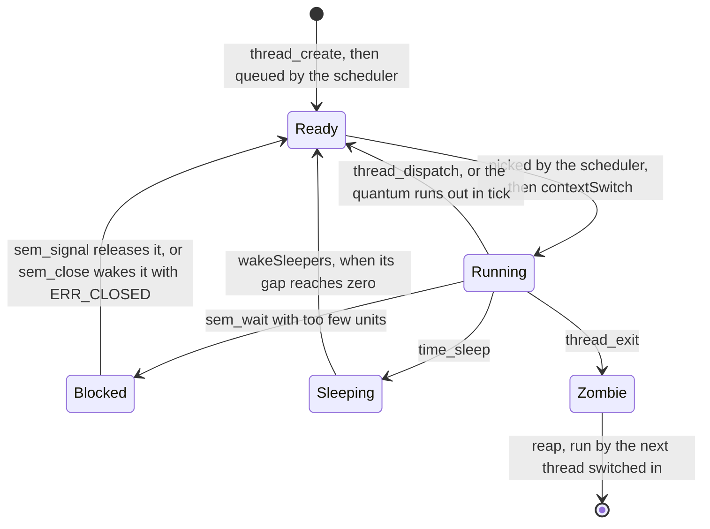

A thread is Ready **exclusive-or** Blocked **exclusive-or** Sleeping — never two at once. That
invariant is what lets one `next` pointer serve three different lists.

### Context switching

```mermaid
flowchart LR
    subgraph OLD["thread A — its own stack"]
        A1["…caller frames…"]
        A2["dispatch frame<br/>spilled ra, s0, s1"]
        A3["trap frame, 272 B"]
    end
    subgraph CS["contextSwitch — 5 instructions"]
        C1["sd ra → A.context.ra"]
        C2["sd sp → A.context.sp"]
        C3["ld ra ← B.context.ra"]
        C4["ld sp ← B.context.sp"]
        C5["ret — jumps to B's ra, on B's sp"]
    end
    subgraph NEW["thread B — its own stack"]
        B1["…caller frames…"]
        B2["dispatch frame<br/>B's spilled ra, s0, s1"]
        B3["trap frame, 272 B"]
    end
    OLD --> CS --> NEW
```

Saving two registers is enough because `ra` and `sp` move as a pair. Every function has already
spilled the callee-saved registers *it* uses into *its own* frame; when a thread resumes, it unwinds
through its own frames and every epilogue reloads the right values from its own stack. A brand-new
thread is the one exception — its `ra` points at `threadWrapper`, so it starts a call chain instead
of finishing one.

This is elegant and it is also the sharpest known risk in the kernel. See
[§20](#20-known-gaps-and-risks) before changing anything near `dispatch()`.

### Entering and leaving a thread

`threadWrapper` is where a new thread begins:

1. `reap()` — free whatever the previous thread left behind.
2. Set the mode bits. A user thread clears `SPP`, sets `SPIE`, and calls `popSppSpie()`, whose
   `sret` lands it in user mode with interrupts enabled. A kernel thread instead sets `sstatus.SIE`
   directly, because it never executes an `sret` and nothing else would ever unmask interrupts for it.
3. `body(arg)`.
4. `thread_exit()` — as an `ecall`, not a direct call. See [decision 16](#19-design-decisions).

`Riscv::popSppSpie` is two instructions, `csrw sepc, ra` and `sret`, and must be
`__attribute__((naked))` and out-of-line. Without `naked`, `-Og -fno-omit-frame-pointer` emits a
prologue whose matching epilogue the `sret` jumps straight past, leaving the caller's `sp` and frame
pointer corrupted. Out-of-line so it can never be inlined — `ra` has to still hold the caller's
return address when `csrw` runs.

### Exit and the zombie slot

A thread cannot free the stack it is standing on. So `exit()` marks itself finished, parks itself in
a single static `zombie` pointer, and dispatches away; the **next** thread to run calls `reap()`,
which frees the stack and deletes the TCB. There are exactly two `reap()` call sites: the top of
`threadWrapper` (for a thread starting fresh) and the bottom of `dispatch()` (for one resuming).

One unguarded slot is safe only because the kernel never preempts itself — the window between
`contextSwitch` returning and `reap()` running cannot be interrupted, so two zombies can never
coexist.

There is no `join`: `thread_exit()` notifies nobody. The public tests poll `volatile bool` flags
instead.

---

## 9. The scheduler

Round-robin FIFO over `ThreadQueue`, an intrusive queue built on `_thread::next` — no allocation,
ever, on the scheduling path.

```cpp
void Scheduler::put(_thread* t){
    if(!t || t == idle) return;      // idle never enters the queue
    ready.put(t);
}
_thread* Scheduler::get(){
    _thread* t = ready.get();
    return t ? t : idle;             // never returns null
}
```

Idle is held aside rather than queued. `get()` handing it out on an empty queue means the scheduler
has no null case for any caller to handle, and `put()` refusing it means it can never take a slot in
the rotation. The idle body is `for(;;) thread_dispatch();` — a supervisor-mode thread whose only
job is to be somewhere to be while nothing is runnable.

`ThreadQueue`'s constructor is `constexpr` on purpose. The kernel never runs `.init_array`, so a
global with a *dynamic* constructor would silently keep whatever `.bss` happened to hold.

---

## 10. Preemption, the timer, and `time_sleep`

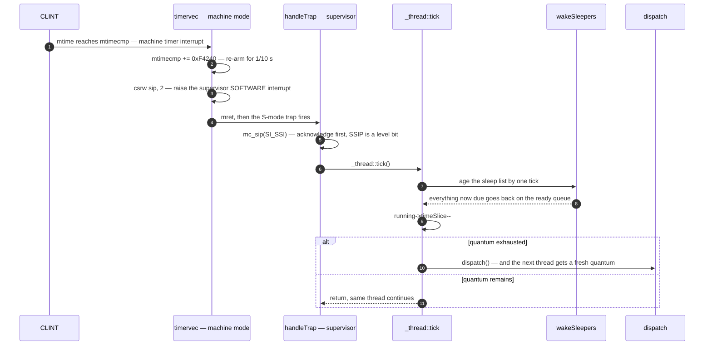

The quantum is `DEFAULT_TIME_SLICE = 2` ticks at 10 Hz, so 200 ms. Renewal happens inside
`dispatch()`, not inside `tick()` — that way a thread that yields voluntarily, or one that has just
been unblocked, gets a full slice too rather than inheriting the remains of someone else's.

### The sleep list is delta-encoded

Sleepers are kept in one sorted list threaded through `_thread::next`, where each node stores the
**gap** to the node before it rather than an absolute wake time. Aging the whole list is then a
single decrement, no matter how many sleepers there are.

```
time_sleep(2), then time_sleep(7), then time_sleep(3), in that order:

  sleepHead ──▶ [ A gap 2 ] ──▶ [ C gap 1 ] ──▶ [ B gap 4 ]
                 wakes at 2      wakes at 3      wakes at 7

one tick: decrement the head only
  sleepHead ──▶ [ A gap 1 ] ──▶ [ C gap 1 ] ──▶ [ B gap 4 ]

another tick: head hits 0, so A is ready — and the walk continues while the
head's gap is 0, which is how several sleepers due on the same tick all wake
  sleepHead ──▶ [ C gap 1 ] ──▶ [ B gap 4 ]        A → Scheduler::put
```

Insertion walks the list subtracting each gap it passes, links the node in, and then shrinks its
successor's gap by its own so the chain stays consistent. The sleeper sets `blocked` before
dispatching, which is what stops `dispatch()` from putting it back on the ready queue.

---

## 11. Semaphores

A semaphore is a non-negative `unsigned value` plus an explicit FIFO of waiters — **not** the
textbook signed counter. The reason is `sem_wait_n`: a single signed integer cannot express "three
threads are waiting, for 5, 1 and 2 units respectively". Each waiter carries its own request in its
TCB.

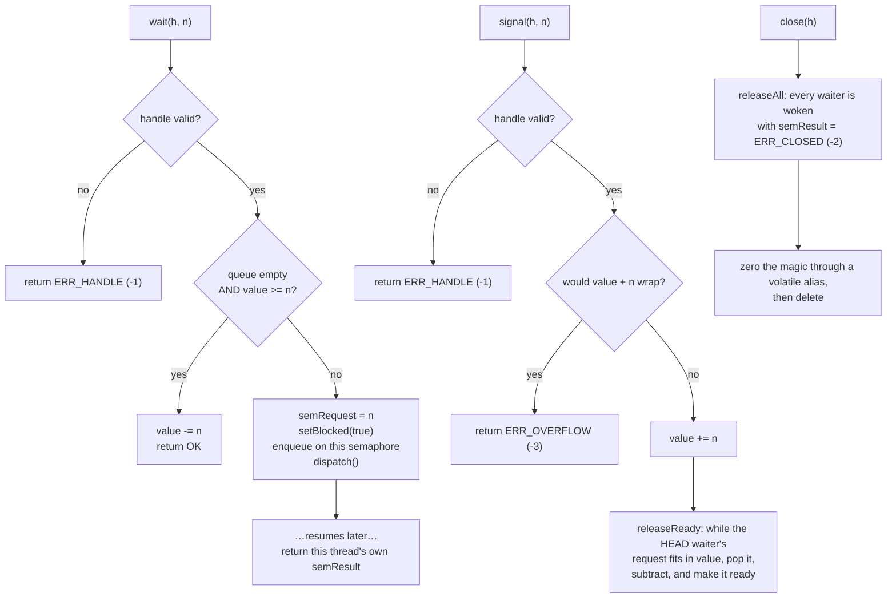

Four things about this implementation are deliberate:

- **Head-blocking FIFO.** `releaseReady` stops at the first waiter it cannot satisfy, even when a
  later, smaller request would fit. And `wait`'s fast path requires the queue to be *empty*, so a
  late arrival cannot barge past someone already queued. Throughput is traded for freedom from
  starvation — and this is exactly what makes `_console::flush()` terminate.
- **The result lives in the waiter's TCB, not in the semaphore.** `sem_close` destroys the
  semaphore while threads are still blocked on it, so the semaphore cannot be the place a waiter
  reads its answer from.
- **A `MAGIC` sentinel** (`0x5E3A0F0051A0BEEF`) catches use-after-close. `close` zeroes it through
  a `volatile uint64*` because the object is deleted on the very next line and a plain store would
  be optimised away.
- **Error codes are negative**, as the spec requires: `-1` bad handle, `-2` closed while waiting,
  `-3` signal would overflow the counter.

---

## 12. The memory allocator

A first-fit allocator over an address-sorted, doubly-linked free list with in-band headers. One
singleton, lazily constructed on first use, owning everything between `HEAP_START_ADDR` and
`HEAP_END_ADDR`.

The unit is a **block** of `MEM_BLOCK_SIZE = 64` bytes. Every segment spends its first whole block
on a header, which keeps every payload pointer block-aligned:

```
one segment — size is measured in BLOCKS and INCLUDES the header block
┌──────────────────────── block 0: header (32 of 64 bytes used) ─────────┐
│ +0   DataBlock* next     free-list successor, sorted by ADDRESS        │
│ +8   DataBlock* prev                                                   │
│ +16  size_t     size     total blocks in this segment, header included │
│ +24  size_t     magic    MAGIC while allocated, 0 while free           │
│ +32  … 63       unused padding — this is what keeps payloads aligned   │
├──────────────────────── blocks 1 … size-1 ─────────────────────────────┤
│ payload. mem_alloc returns (char*)header + MEM_BLOCK_SIZE              │
└────────────────────────────────────────────────────────────────────────┘
```

**Allocation** walks the free list for the first segment of at least `size + 1` blocks. If the
remainder would be 2 blocks or more it splits, leaving the tail in the free list and trimming the
returned segment's `size` to exactly what was handed out; if the remainder is 0 or 1 blocks — too
small to ever hold a header plus payload — the whole segment goes out as-is rather than leaving an
unusable fragment behind.

```
split, when the leftover is worth keeping:
  before  │◄──────────── free, 9 blocks ────────────►│
  after   │◄─ allocated, 3 ─►│◄──── free, 6 ────────►│

absorb, when it is not:
  before  │◄──────────── free, 4 blocks ────────────►│
  after   │◄──────── allocated, all 4 ──────────────►│
```

**Freeing** validates before it touches anything, then coalesces both ways:

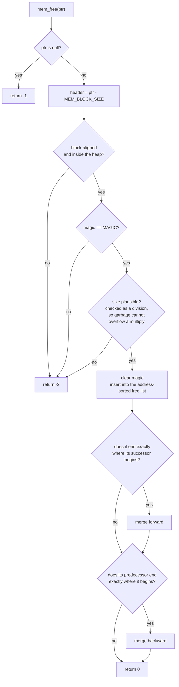

Two conversions are worth knowing about. The byte-to-block rounding lives in the **C API**, because
the ABI is specified in blocks. And `_thread` and `_sem` each define a **class-scope**
`operator new` that calls the allocator directly rather than going through the global one — the
global `operator new` issues an `ecall`, and both of these objects are constructed *inside* the trap
handler, where a nested trap is not what you want.

---

## 13. The console

Two bounded rings of 256 bytes, three semaphores, one supervisor-mode drainer thread, and no locks
at all.

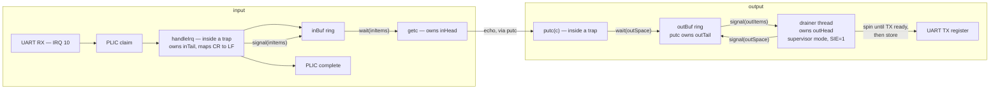

**No locks, and that is a claim about who runs when.** Each index has exactly one writer — `putc`
owns `outTail`, the drainer owns `outHead`, the interrupt handler owns `inTail`, `getc` owns
`inHead` — and every one of them except the drainer runs inside a trap, where the hardware has
already masked interrupts. The two ends of a ring never touch the same variable, and the fill level
is never inferred from `head == tail`: the semaphores *are* the count.

Four more decisions that are easy to "clean up" and should not be:

- **The drainer enters the kernel through `ecall`.** It calls `sem_wait`, the user-facing C API,
  from kernel code. A kernel thread runs with `SIE = 1` and outside any trap, so touching the
  scheduler's queues directly from there would race the timer interrupt. `threadWrapper`'s
  `thread_exit()` is the same trick for the same reason.
- **Echo happens in `getc`, not in the interrupt handler.** That keeps the drainer the only writer
  of the transmit register in normal operation. An echo written from the handler would have to poke
  the device itself, possibly into a register the drainer had just tested as empty. The cost is that
  a character appears when a thread reads it rather than when it arrives — in practice the same
  instant.
- **The transmit interrupt is switched off at the device.** `hw.lib`'s `uartinit` leaves `IER` at
  `0x03` for xv6's interrupt-driven transmitter; this driver polls instead, so that half would be a
  source nothing acknowledges. `IER` (the byte after `CONSOLE_TX_DATA` — `hw.h` does not name it) is
  set to `0x01`, receive only.
- **`flush()` is `sem_wait_n(outSpace, CAPACITY)` followed by a matching signal.** Acquiring every
  slot at once *is* "the buffer is empty", and because the drainer releases a slot only after the
  byte has reached the transmit register, a returning `flush` means everything has left the machine.
  Head-blocking is what makes it terminate: a thread calling `putc` while the flush waits queues up
  behind it instead of stealing the slot it just freed.

If `init()` fails at any step — no memory for the semaphores or the drainer's stack — `drainer`
stays null, `IER` is cleared, and both `putc` and `getc` fall back to polling the device directly.
The kernel keeps a console under every failure it can survive.

---

## 14. The C++ API layer

A pure adapter over the C API: no state of its own, no syscalls of its own. The class definitions
are fixed by the spec and may not be extended.

```cpp
void* operator new   (size_t n)        { return mem_alloc(n); }   // and new[]
void  operator delete(void* p) noexcept{ mem_free(p); }           // and delete[]
```

`Thread` holds a handle, a function pointer and an argument. `start()` creates the kernel thread
over a static `wrapper`, passing `this`; the wrapper calls `body(arg)` if one was supplied and the
virtual `run()` otherwise — which is what lets a subclass override `run()` and a plain user pass a
function, through one mechanism.

`PeriodicThread` reuses its `period` field as the terminate flag:

```cpp
void PeriodicThread::terminate() { period = 0; }

void PeriodicThread::run() {
    while (period) {
        periodicActivation();
        if (period) Thread::sleep(period);
    }
}
```

The inner `if (period)` matters: without it, a `terminate()` issued from *inside*
`periodicActivation()` would still be followed by one last `Thread::sleep(0)`. A `terminate()` from
another thread takes effect up to one period late, since the target is parked in `time_sleep` when
it arrives.

---

## 15. Class overview

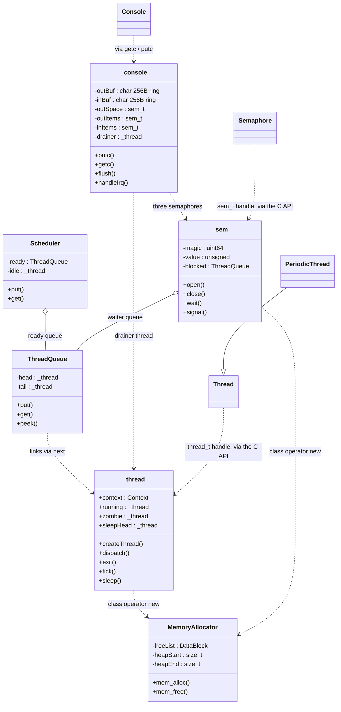

---

## 16. Build system

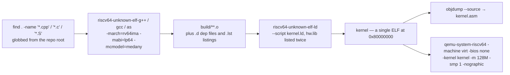

Flags, verbatim from the Makefile:

```
-march=rv64ima -mabi=lp64 -mcmodel=medany -mno-relax
-nostdlib -ffreestanding -fno-common -fno-omit-frame-pointer
-std=c++11 -fno-rtti -fno-threadsafe-statics      (C++ only)
-Wall -Werror -Og -ggdb
```

Five of these are load-bearing rather than stylistic:

- **`-march=rv64ima`** — the `a` extension is needed for `lr.w`/`sc.w`, used by the userspace
  spinlock in `test/lock.S`.
- **`-fno-threadsafe-statics`** — without it, the function-local static in
  `MemoryAllocator::getInstance()` emits `__cxa_guard_acquire`/`__cxa_guard_release`, which do not
  exist in a `-nostdlib` build. For the same family of reasons `MemoryAllocator` must never acquire
  a destructor, which would pull in `__cxa_atexit`.
- **`-mcmodel=medany`** — the image is linked at `0x80000000`, outside medlow's reach.
- **There is no `-I`.** The include lines in the Makefile are commented out, which is why every
  source uses relative includes like `#include "../lib/hw.h"`.
- **`${LDLIBS}` appears twice on the link line** — a poor man's `--start-group`, because `ld` pulls
  from an archive only what is unresolved at the moment it reads it.

### Three traps in the build that have each cost a source file

- **Sources are globbed from the repo root with `find . -printf`.** That is GNU find, so the build
  does not run on a stock macOS host — use the container. It also means *any* stray `.cpp` or `.S`
  anywhere under the root is swept into the link. Reference projects kept locally for study must
  live outside the tree.
- **A `.S` file may not share a basename with a `.cpp` file.** Both map to the same `build/…/x.o`
  and make silently builds only one of them.
- **Do not bind-mount the repo onto `/kernel` on macOS.** There is no `%.S` rule, so make chains its
  built-in `%.s: %.S` preprocessor rule into the explicit `%.o: %.s` rule and then deletes the
  intermediate. On a case-insensitive filesystem `trapEntry.s` *is* `trapEntry.S`, so make
  overwrites the source and then removes it. Copy the tree into the container instead — its
  filesystem is case-sensitive.

`CMakeLists.txt` exists for CLion and clangd indexing only; its `os1_indexing` target is
`EXCLUDE_FROM_ALL` and will not link against a host toolchain. Its Docker convenience targets use
the image name `os1-build`, while `docs/md/runCommands.md` and this README use `riscv-kernel` —
if you use the CMake targets, build the image under that name too.

---

## 17. Running the tests

`test/` holds the seven public tests exactly as the course supplies them. Only `userMain.cpp` is
edited — it sets `LEVEL_1_IMPLEMENTED` through `LEVEL_4_IMPLEMENTED` (all `1` here) and dispatches
on a digit read from the console.

Those macros gate **dispatch only, not compilation**. Every test file is compiled and linked
regardless, so every symbol any of them names must exist before anything runs at all.

| # | Test | What it exercises |
|:-:|---|---|
| 1 | `Threads_C_API_test` | Four threads over the C API with cooperative `thread_dispatch`. Checks that a temporary register survives a context switch, and runs recursive `fibonacci` across switches |
| 2 | `Threads_CPP_API_test` | The same, through `Thread` subclasses overriding `run()` |
| 3 | `ConsumerProducer_C_API_test` | A keyboard producer plus N compute producers and a consumer, over a semaphore-guarded bounded buffer. C API throughout |
| 4 | `ConsumerProducer_CPP_Sync_API_test` | Same topology through the C++ API, still with synchronous switching |
| 5 | `ThreadSleep_C_API_test` | Two threads sleeping 10 and 20 ticks for five iterations — the sleep list under two different periods |
| 6 | `ConsumerProducer_CPP_API_test` | Producer/consumer under **asynchronous** switching, i.e. timer preemption |
| 7 | `System_Mode_test` | That user code really runs unprivileged |

Tests 3, 4 and 6 ask three questions — test number, producer count, buffer size — and need an
**ESC** (`\033`) to stop the keyboard producer. Driving them without a terminal:

```bash
# test 1
(sleep 3; printf "1\n"; sleep 60) | timeout 75 make qemu

# tests 3 / 4 / 6
(sleep 3; printf "3\n"; sleep 1; printf "2\n"; sleep 1; printf "5\n"; \
 sleep 8; printf "\033"; sleep 8) | timeout 40 make qemu
```

### Test 7 is supposed to die

One of its threads executes `csrr t6, sepc` — reading a supervisor CSR. If the kernel has correctly
cleared `SPP` before `sret`, that thread is unprivileged and the instruction must raise illegal
instruction, `scause = 2`. The course's own instructions say so: *"Očekivano ponašanje za test 7
jeste da ne dolazi do regularnog završetka procesa."*

The fault path used to end in `for(;;)`. Since `sepc` does not auto-advance on an illegal
instruction, there was no way forward and no way out — QEMU had to be killed by hand. It now prints
`scause` and `sepc` and halts the machine through the same `0x5555 → 0x100000` store the normal
shutdown uses, so the expected failure ends the run cleanly.

---

## 18. Debugging

`make qemu-gdb` boots halted and opens a GDB port at `$(id -u) % 5000 + 25000`, i.e. `25000` for
uid 0. Attach from a second shell in the same container:

```bash
docker exec -it os1 bash
gdb-multiarch kernel
(gdb) target remote localhost:25000
```

**Caveat:** `make qemu-gdb` depends on `.gdbinit`, which is generated from `.gdbinit.tmpl-riscv` —
and that template is not in the repo, so the target currently fails with *no rule to make target*.
Until it is added, run QEMU directly:

```bash
make
qemu-system-riscv64 -machine virt -bios none -kernel kernel -m 128M -smp 1 -nographic \
                    -S -gdb tcp::25000
```

When a trap reports an address you do not recognise, `kernel.asm` is the place to look — it is
`objdump --source` over the linked image, so kernel C++ and its generated assembly sit side by side,
`hw.lib`'s machine-mode code included.

---

## 19. Design decisions

These are the choices that shaped the kernel, with the reasoning that justifies them.

**Threads and the kernel's execution model**

1. **The kernel runs on the interrupted thread's own stack.** No separate kernel stack per thread,
   no stack switch on trap entry. This is what makes `Context` two registers and what makes a
   mid-trap context switch free of CSR bookkeeping.
2. **The kernel never preempts itself.** Not required, and saying no is what makes the one-slot
   zombie safe without a guard — the only window in which it could be overwritten is between
   `contextSwitch` returning and `reap()` running, which a non-preemptive kernel closes.
3. **TCBs are heap-allocated**, through a class-level `operator new` routed to `MemoryAllocator`. A
   static slot pool would cap the thread count, and "how many threads before it falls over" is
   exactly what a hidden test probes.
4. **FIFO scheduling**, explicitly endorsed by the spec. Idle is handed out by `Scheduler::get()`
   on an empty queue rather than living in the queue.

**Semaphores**

5. **Non-negative value plus an explicit waiter queue**, not a signed counter — forced by
   `sem_wait_n`.
6. **Strict head-blocking FIFO**, trading throughput for freedom from starvation. Free for
   `n == 1` semaphores, and load-bearing for `flush()`.
7. **A blocked thread's result lives in its own TCB**, because `close()` outlives neither the
   semaphore nor the wait.
8. **Queueing is one shared primitive.** `ThreadQueue` is an intrusive FIFO over `_thread::next`,
   used by the scheduler and by every semaphore. Its `constexpr` constructor is deliberate: the
   kernel never runs `.init_array`.

**Timer and preemption**

9. **The trap frame is the single source of truth for `sepc`/`sstatus`.** Because it sits on the
   thread's own stack, each thread restores its own copy on the way out.
10. **The sleep list is delta-encoded**, threaded through `_thread::next`. One decrement per tick
    however many sleepers there are. Sharing the link with the ready and semaphore queues is sound
    only because a thread is ready XOR blocked XOR sleeping.
11. **`blocked` is the general "not runnable" flag**, not a semaphore-specific one. `dispatch()`
    reads it to decide whether the running thread goes back on the ready queue, and neither the
    semaphore nor the sleep list needs to say which of them parked the thread.
12. **Quantum renewal happens in `dispatch()`, not `tick()`** — so yielding and unblocking earn a
    full slice too, not just preemption.
13. **Mode bits are set, never inherited**, when a thread first leaves the kernel.

**Console**

14. **Bounded buffer at each end, and the syscalls block rather than spin.** Output is drained by a
    supervisor-mode kernel thread; input is filled by the external interrupt. The only polling in
    the driver is inside the drainer and on the panic path.
15. **No locks anywhere, and that is a claim about who runs when.** One writer per index, and every
    writer but the drainer runs inside a trap with interrupts already masked.
16. **The drainer enters the kernel through `ecall`**, not by calling `_sem::wait` directly — it
    runs with `SIE = 1` and outside any trap, so touching scheduler state directly would race the
    timer. Do not "clean this up" into a direct call.
17. **Echo happens in `getc`, not in the interrupt handler**, so the drainer stays the only writer
    of the transmit register.
18. **`flush()` is `sem_wait_n(outSpace, CAPACITY)`.** Acquiring every slot at once *is* "the buffer
    is empty", and head-blocking is what makes it terminate.
19. **The transmit interrupt is switched off at the device** (`IER = 0x01`). This driver's
    transmitter is polled, so an enabled TX interrupt would be a source nothing acknowledges. On
    this QEMU that does not livelock — measured, not assumed — so the store is hygiene and
    version-insurance rather than a fix.

---

## 20. Known gaps and risks

Nothing below is hypothetical. This is what is actually unproven or fragile.

**The two-register `Context` holds by codegen, not by design.** `dispatch()` spills only `ra`, `s0`
and `s1`, so any caller keeping a value live in `s2`–`s11` across a switching call would read the
*other* thread's register. It is correct today: `_sem::wait` keeps its `caller` pointer in `s1` and
`handleTrap` keeps `frame` in `s1`, and both are recovered from their own frames on the way back;
`handleTrap`'s `s2` and `s3` are live only in the `0x11` and panic paths, neither of which can
context-switch. A more register-hungry `handleTrap`, a differently-shaped `_sem::wait`, or a move
away from `-Og` could break this silently. Treat any change near `dispatch()` as a change to the
context switch itself.

- **Each public test has had roughly one clean pass on the current tree.** Preemption makes runs
  non-deterministic, which cuts both ways: repeats are worth more than they were under cooperative
  scheduling, and a single pass is worth less.
- **`PeriodicThread` is covered by no public test.** The nearest any of them comes is test 6's
  `Thread::sleep`. It was verified once against a throwaway harness — five activations at period 3
  with deltas 2/3/3/3 and no sixth; two threads at periods 2 and 5 firing exactly 15 and 6 times in
  30 ticks; `terminate()` from another thread freezing the count with no trailing activation; period
  0 activating zero times. That harness is not in the tree. It is also the only evidence the
  delta-encoded sleep list carries several sleepers at different periods.
- **The allocator has barely been stressed** — a handful of 4 KiB stacks, no churn, no exhaustion,
  no fragmentation pressure. It is the least-defended part of the kernel.
- **`sem_wait_n` and `sem_signal_n` are exercised mainly through `_console::flush()`**, not by any
  test written for them.
- **`Thread::~Thread()` is empty**, so a destroyed `Thread` leaks its kernel handle.
- **`getc()` returns `char`** as the spec dictates, while the kernel's `_console::getc` returns
  `int` and can return `EOF`. Narrowing makes `EOF` indistinguishable from the byte `0xFF`.
- **The fault path prints `scause` and `sepc` but not `stval`**, even though `Riscv::r_stval()`
  exists and `stval` is often the one that identifies the faulting address.

---

## 21. Practice-modification branches

The oral defense includes a live modification: implement a new feature on the spot. Each past
exam's modification is rehearsed on its own branch off `main`, carrying its task description in
`MODIFICATION.md` and a `test/Modification_test.cpp` wired in as test 8. **None of them is ever
merged back**, which is why `main` shows no trace of them.

| Branch | Modification | New ABI codes |
|---|---|:---:|
| `july-2022` | `getThreadId()` and `PeriodicThread::stopThread()` | — |
| `aug-2023` | `Thread::SetMaximumThreads(num, max_time, interval)` — admission semaphore plus a releaser thread | `0x14` |
| `sept-2024` | `Thread::pair()` / `Thread::sync()` — task description and scaffold only | — |
| `sep-2025` | Matrix histogram: an M×N matrix, one thread per row, merged into a shared histogram | — |
| `oct-2025` | `thread_add_child()` / `thread_join_all()`, plus `Thread::addChild` / `joinAll` | `0x14`, `0x15` |
| `feb-2026` | `static void Thread::barrier()` over a counting semaphore | `0x14` |
| `aug-2026` | `send(thread_t, char*)` / `receive()` inter-thread messaging | `0x14`, `0x15` |

`aug-2026-practice` is a working copy of the `aug-2026` attempt and exists on the remote only.

---

## 22. Spec, grading, licence

The assignment is [`docs/md/OS1-Projektni-zadatak-2026-v1.0.md`](docs/md/OS1-Projektni-zadatak-2026-v1.0.md)
(a transcription of [the PDF](docs/pdf)); `docs/md/runCommands.md` is a Docker cheatsheet.

| Part | Points |
|---|:---:|
| 1 — memory allocation (`mem_alloc`, `mem_free`) | 5 |
| 2 — threads (`thread_create`, `thread_exit`, `thread_dispatch`), synchronous switching | 10 |
| 3 — semaphores, including `sem_wait_n` / `sem_signal_n` | 5 |
| 4 — asynchronous switching: timer, preemption, `time_sleep`, console, `PeriodicThread` | 10 |
| 5 — bonus, defended in the early exam period | 10 |

To defend, public tests worth **≥ 20 points** must pass and the defense itself must score **≥ 15**.
Parts 3, 4 and 5 all depend on part 2, and **every part must implement all three interface layers**
for the calls it covers. Submission is a single zip of exactly `src/` and `inc/`.

Licence: the xv6 MIT licence (Kaashoek, Morris, Cox — MIT, 2006–2019), plus the course's own
modification notice (Živojin Šuštran, University of Belgrade, 2022). See [`LICENSE`](LICENSE).
